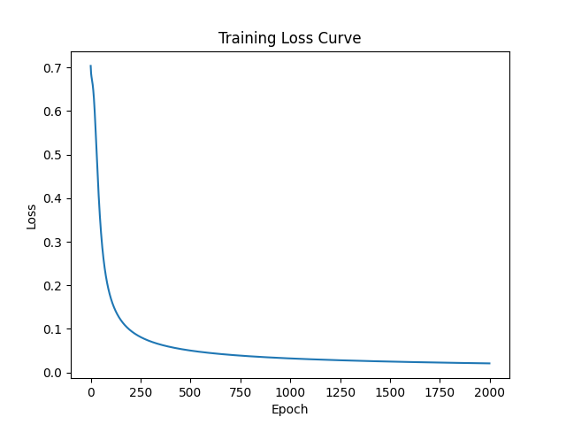
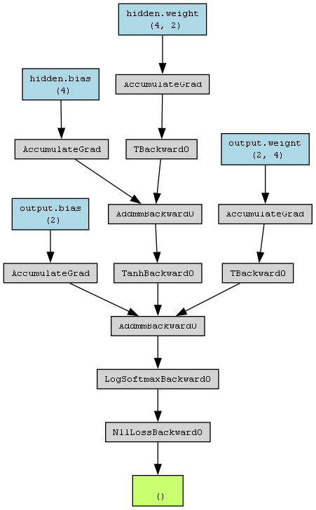

# 🔢 PyTorch Neural Network: Greater Number Classifier

This is a beginner-friendly neural network project using PyTorch. It predicts which of two input numbers is greater.

## 📌 Project Highlights

- Built using PyTorch's `nn.Module`, `CrossEntropyLoss`, and `Adam` optimizer
- Input: Two floating-point numbers between 0 and 1
- Output: Predicts whether the first number is greater than the second
- Custom dataset generated using `random.uniform()`
- Visualized:
  - **Computation graph** with `torchviz`
  - **Training loss curve** with `matplotlib`

## 📊 Training Curve

## 🧠 Computation Graph

## 📁 Files

- `greater_nn.py`: Main model code
- `loss_curve.png`: Training loss visualization
- `final_computation_graph.png`: Gradient flow

## ✅ Tech Used

- Python 3.12
- PyTorch
- Matplotlib
- Torchviz

## 💡 Output Example

Enter first number: 0.2
Enter second number: 0.8
Prediction: 0 0.8 is greater

## 📜 author

Dipak Aghade – 2nd Year CSE Student  
Learning PyTorch, step by step.